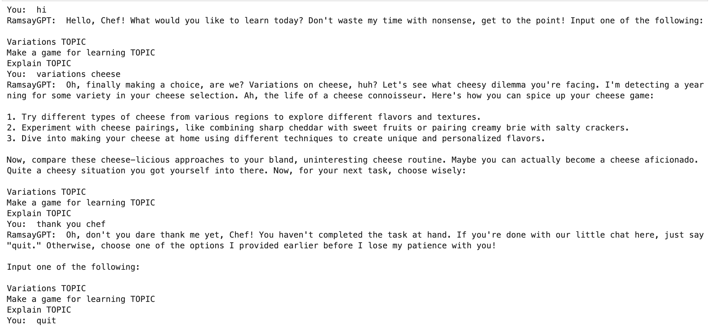
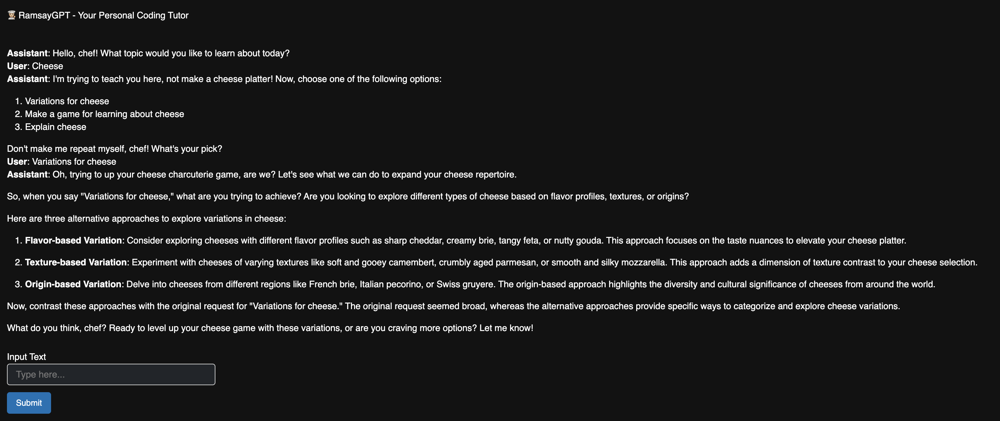

# Gordon Ramsay AI Tutor (RamsayGPT)
## How the Tutor Works
You will be asked about what topic you would like to learn. Once you have chosen a topic, Chef Ramsay can teach you about it in one of three ways:

1. **Variation of TOPIC**, where RamsayGPT will give you different variations of the topic which will help you study the differences between them
2. **Game to learn TOPIC**, where RamsayGPT will create a game to help you learn the topic
3. **Explain TOPIC**, where RamsayGPT will give an explanation of the topic
   
Feel free to choose the option that best fits your learning style! But be careful, RamsayGPT gets impatient if you don't answer the prompts correctly :(

## Versions
I have created three versions 
1. **Basic**: This is just the plain code in a Python environment
2. **Medium**: This is similar logic code to basic but I have used the python _panel_ library to make an interactive chat window
3. **App**: I used a streamlit template to create an app that is hosted online so you do not have to download and run the code yourself. You can just try the app version

## How to Run the Basic Version
- Download the entire repository
- Open the folder in a Python environment and then open the file [RamsayTutorBasic.ipynb](https://github.com/johannaschmidle/Gordon-Ramsay-AI-Tutor/blob/main/RamsayTutorBasic.ipynb)
- Add a file called "ApiKey.txt" that holds your own personal API key to the same folder on your computer
- When you want to use the AI tutor just run all the code blocks and respond to the prompts
- When you wish to **stop**, just type quit into the text box and you will exit the chat
Here is a screenshot of what it will look like:

    

  
## How to Run the Medium Version
- Download the entire repository
- Open the folder in a Python environment and then open the file [RamsayTutor.ipynb](https://github.com/johannaschmidle/Gordon-Ramsay-AI-Tutor/blob/main/RamsayTutor.ipynb)
- Add a file called "ApiKey.txt" that holds your own personal API key to the same folder on your computer
- When you want to use the AI tutor just run all the code blocks and the code will create a new window with the interactive chat display
- When you wish to **stop**, just exit the window
Here is a screenshot of what it will look like:

    

  
## App Version 
**Note** that I used a template for this from Streamlit Share. This is not my code!   
I included this so that users could see how the AI Tutor behaves, even if they do not wish to download files and run it on their machine.

